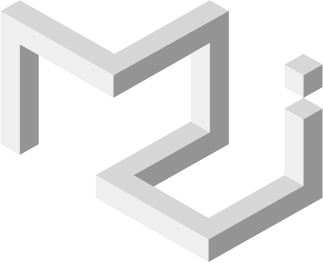
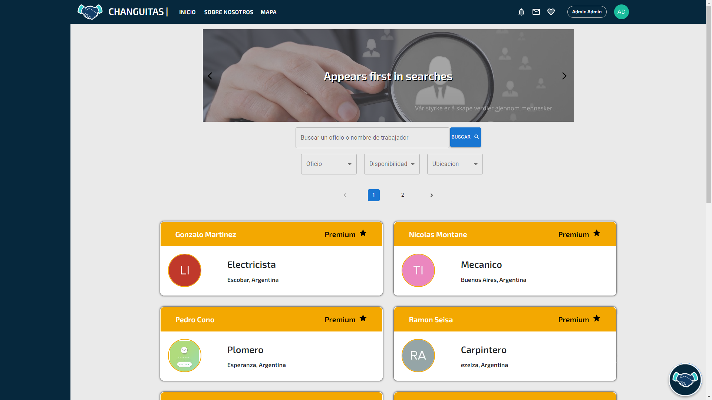
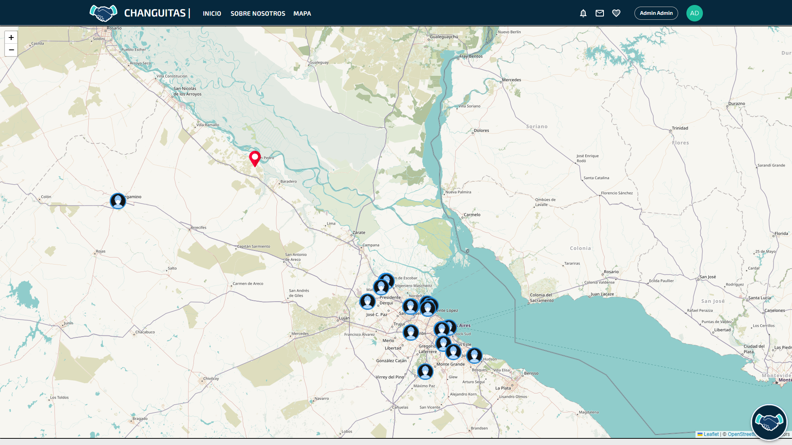

<h1 align="center">Hola 👋, soy Nicolas Asef</h1>
<h3 align="center">Full Stack Developer</h3>

Apasionado por la programación y la tecnología 😄😄.

Soy Full Stack Developer 🎓 egresado de www.soyhenry.com, estoy interesado en el mundo del desarrollo de software y también por el aprendizaje constante de nuevas tecnologías.

 
<h3>Contactame: </h3>

 &nbsp&nbsp<a href="https://www.linkedin.com/in/nicolas-asef/" target="_blank">LinkedIn</a>

 &nbsp nicolasasef1@gmail.com

<a href="https://nicolas-asef-portfolio.vercel.app/" target="_blank"> 💼 Portfolio</a>

<h3 align="left">Lenguajes y Tecnologias</h3>

 
 
 
 
 
 
 
 
 
 
 
 

 
<h3>🚀 Proyectos 🚀 </h3>

Una pagina web orientada a la búsqueda laboral dirigida a personas que tengan un oficio. Podrás contratar gente y contactar con ellos. Teniendo la posibilidad de hacerte trabajador premium y poder acceder a mas beneficios y visualizaciones. Autenticación de terceros. Base de datos. Dashboard de administrador. Soket.io. Borrado Logico. Se trabajo con la metodologia SCRUM. 

                                                                                                                            
<a href="https://font-pf.vercel.app/" target="_blank"> https://font-pf.vercel.app/</a>

<!--
**nicolas-asef/nicolas-asef** is a ✨ _special_ ✨ repository because its `README.md` (this file) appears on your GitHub profile.

Here are some ideas to get you started:

- 🔭 I’m currently working on ...
- 🌱 I’m currently learning ...
- 👯 I’m looking to collaborate on ...
- 🤔 I’m looking for help with ...
- 💬 Ask me about ...
- 📫 How to reach me: ...
- 😄 Pronouns: ...
- ⚡ Fun fact: ...
-->
